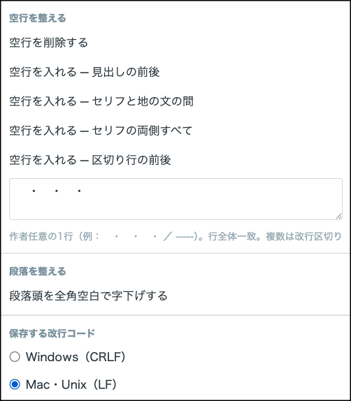

# 左で参照して右で書く超高速テキストエディタ　novedit

設定やプロット、推敲前の文章などを左側に表示してタブ切り替えで見ながら、右側で執筆できるテキストエディタです。全体視認性と高速性に特化しており、ブラウザ上で軽快に動作します。

* 作者: [やまもりやもり](https://yamamori-yamori.github.io/mypage/)
* 外部サーバー・CDN不要。ローカルHTMLアプリ。
* ブラウザでHTMLファイルを開くだけで動作します。Windows / mac / iPadも対応(chrome推奨)
* 日本語長編小説を前提に設計されていて、10万文字超えていても快適に動作します(180万文字までテストしました)
* 検索でミニマップ上に全件ハイライト表示など、一覧性に優れています。
* 作者HPにWEB版もあります。

\---

## 使い方

1. [こちら](https://github.com/yamamori-yamori/novedit/raw/refs/heads/main/novedit.zip)をダウンロードしてzipを解凍し、`novedit.html` をブラウザで開く（Chrome 推奨）。  
または、 [作者HP](https://yamamori-yamori.github.io/mypage/)から「WEB版」をご使用ください。
2. 右ペインをクリック、またはドラッグアンドドロップで、編集したいファイルを設定してください。
3. 左ペインには参照したいプロットや設定などのテキストファイルを置いてタブで切り替えて見ることができます。  
　参照テキストタブの他に、右ペインで編集しているテキストの初期状態と初期状態からの差分のタブもありますので、間違えて消してしまった時などにここからコピーで戻すことができます。なお、左右ペインの区切りはマウスで動かせます。
4. スクロールホイールで高速スクロールできます。また両脇のミニマップをマウスドラッグでも高速スクロールできます。
5. ctrl-Zか右上の「戻す」でundo可能です。さらに編集したテキストはブラウザに自動保存されています。ブラウザを閉じても次回開いたときに続きを再開できます。

!\[screen shot](スクリーンショット.png)  
(←で参照用テキスト表示、→で執筆）

## 便利な機能

### ※見出し設定とミニマップ

* 右上の「見出し」右側の設定アイコンから「章」や「話」の設定ができます。本文で色付きになるほか両脇のミニマップにもカラー表示されます。
* 検索ヒットした単語もミニマップに黄色で表示され、どこにあるかが一目でわかります。
* `\\\\\\\\\\\\\\\*\\\\\\\\\\\\\\\*`や`\\\\\\\\\\\\\\\*\\\\\\\\\\\\\\\*\\\\\\\\\\\\\\\*`で囲んだ単語は本文に強調表示できます。キーワードをプロットに記載するときなど便利。

  

### ※テキスト整形ツール

* 画面上「ツール」メニューから、空行を削除したり、会話や見出しの前後に空行を入れたりが一発で出来ます！

  

### ※その他

* 左ペインで選択した文字列を掴んで、右ペインにそのままコピーできます（ctrl-C/V不要）。
* iPadではブラウザの「HOME画面に追加」でアドレスバーなしで使うことも出来ます。
* Undoは通常のテキスト編集では制限がありませんが、全文を対象とする操作（ツールや全て置換、新規、挿入など）は10回までです。また全文を対象とする操作にはRedo(再実行)はありません。

  
## キー操作リスト

### ショートカットキー

* Ctrl/Cmd+Z          Undo（戻す）
* Ctrl/Cmd+Shift+Z / Ctrl+Y Redo(再実行)
* Ctrl/Cmd+S          上書き保存（保存ダイアログ無し。ただし上書きができる状態でない場合は別名で保存）
* Ctrl/Cmd+Shift+S    別名で保存（名前を付けて保存）
* Ctrl/Cmd+F          検索欄にフォーカス
* Ctrl/Cmd+H          置換バーを表示
* Escape              現在の操作をキャンセル／見出し設定のメモを閉じる（＋メニュー類を閉じる）
* Ctrl/Cmd+C / Ctrl/Cmd+X / Ctrl/Cmd+V   コピー・切り取り・貼り付け
* Ctrl/Cmd+A          編集テキストの全選択
* Ctrl/Cmd+↑         前の見出しへジャンプ（shift押しながらで選択可）
* Ctrl/Cmd+↓         次の見出しへジャンプ（shift押しながらで選択可）

### 検索欄・置換欄の中で

* Enter            次（下方向）のヒットへ移動
* Shift+Enter      前（上方向）のヒットへ移動

\---

LICENSEはMITライセンスです。改変、再配布、商用もご自由にどうぞ。  
（作者名「やまもりやもり」は残してください）  
※制作者自ら使っておりますので安定性は高いと思いますが、ユーザーのご使用に対して製作者は一切の責任を持ちません。ご了承ください。

\---

更新履歴

## ver.1.1 公開

## ver.1.2.6 更新

■不具合対応（レスポンス軽量化）

* 長文小説の後ろの方にIMEから日本語を挿入すると重くなる不具合を修正しました。

■新機能

* 見出しジャンプ：ctrl+↓ でこの話の終わり／↑で頭まで移動。+shiftで一話選択が簡単にでき、投稿サイトへのコピペに便利。
* 選択した部分の文字数を表示(空白含む。改行除く）  
　タイトルやあらすじの文字数が簡単に分かる。見出しジャンプと合わせると話の文字数も一目で分かります。

■PWAモード

* WEB版にPWAモード（ブラウザアプリとしてのインストールモード）を搭載。  
→chromeのURL欄アイコンで「インストール」を選ぶと、ブラウザアプリとしてURL欄なしの全画面で使え、また「ファイルを右クリックして拡張子を紐づけ」などの設定が可能になります。
* iPadで「HOMEに置く」した時、オフライン使用にも対応。

■改善

* ツールメニュー：改行を入れるに「段落とセリフの両側すべて」を追加。
* 見出し：見出しON/OFFと見出し設定メニューを統合しました。
* 左ペインの「初期」タブで「←現状を初期に設定」したときにスクロール位置も現状に合わせます。
* 左ペインでタブが多い時の挙動を改善しました。
* iOSでも保存ファイル名を変えられるようになりました。
* ブラウザでアプリを二つ開いた時、古い方は警告を出して自動保存を停止します。自動保存による互いの上書きを防ぎます。

## ver.1.2.7 更新

■ctrl-A対応：　ctrl-Aで編集テキストの全選択（ver.1.2.6で漏れていました）

## ver.1.3.5 更新

■新機能

* 右タブで編集中の文章と、左タブで閲覧中の文章を入れ替えできるようにした。  
(右タブがセーブしていないときはセーブを求められます）

■改善

* 見出しジャンプ（ctrl(cmd) + ↑ / ↓）で、ファイルの先頭・末尾も行くようにした。　　
* macのchromeでもPWAモードを使えるようにした(拡張子紐づけ可能)　　
* ハイライト色のスクロールが遅れる・長文でハイライトがズレる・「新規」で前のハイライトが残る問題を解消。　　
* 検索が文章の最初からになっていたのを、カーソル位置からに変更。　　

## ver.1.3.6 更新

■改善

* 編集中の文章をバックグラウンドで更新された時にワーニングを出して再読み込みできるようにした。同じ文章を左右で開いて入れ替えによってバージョン違いになった場合もワーニングが出る。

## ver.1.4.6 更新

■新機能

* 中央上に「差分」ボタンを配置し、ここから差分モードに移行できる。  
この差分モードには別アプリの「novdiff」の機能が搭載されていて、左右のペインを行ごとに比較し違いのあるテキストに色付けをして表示する（prev↑/next↓で前次の差分に移動します）

　   また右ペインは行ごとの編集となります。  
（この機能の搭載により従来の「変更」タブは削除しました）
!\[screen shot](novedit差分モード.png)  

\---

